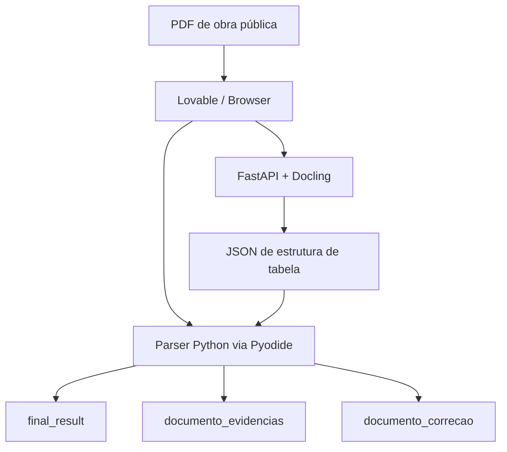

# ParserOrca / PaserEngDocs

Parser Python para análise de documentos de obras públicas, orçamento de infraestrutura e estruturas tabulares extraídas de PDFs.


## Visão geral

ParserOrca combina um parser Python executável no navegador com uma API auxiliar baseada em Docling. O objetivo é transformar documentos PDF de obras públicas em JSON estruturado, mantendo rastreabilidade, evidências e um documento de correção para revisão humana.

O parser foi projetado para operar no fluxo do Lovable via Pyodide: o navegador executa a lógica principal em Python, enquanto uma API FastAPI com Docling identifica a estrutura de tabelas em trechos selecionados do PDF. O JSON retornado pela API alimenta o parser, que consolida orçamento, composições, evidências e pendências de revisão.

## Problema resolvido

Documentos de orçamento público geralmente possuem tabelas extensas, quebras de linha, composições, códigos, valores e estruturas hierárquicas difíceis de converter para dados confiáveis. O projeto organiza esse processo em um pipeline verificável:

1. O PDF é carregado no navegador.
2. O browser envia somente as páginas necessárias para a API Docling.
3. A API retorna a estrutura detectada das tabelas.
4. O parser Python interpreta as linhas, campos, composições e totais.
5. O resultado é produzido em JSON com evidências e documento de correção.
6. A interface pode destacar página, item e divergência para revisão.

## Arquitetura resumida



## Estrutura do repositório

```text
api_docling/       API FastAPI que usa Docling para extrair estrutura de tabelas
parser_browser/    Parser Python compatível com execução em navegador/Pyodide
docs/              Documentação técnica objetiva e contratos principais
schemas/           Schemas JSON de entrada e saída
examples/          Payloads e exemplos de integração
tests/             Testes de contrato, regressão e consistência
```

## Componentes principais

| Componente | Função |
| --- | --- |
| `parser_browser/app/browser/` | Entrada do parser para ambiente browser/Pyodide |
| `parser_browser/app/parser/` | Pipeline de parsing, reconciliação, evidências e correções |
| `parser_browser/app/core/` | Modelos, normalização, contratos e utilidades centrais |
| `parser_browser/app/integrations/` | Cliente e adaptação das respostas da API Docling |
| `api_docling/app/` | API FastAPI para análise estrutural de tabelas |
| `schemas/` | Contratos JSON de entrada e saída |
| `tests/` | Testes de regressão e estabilidade de contrato |

## Executar testes

```bash
python -m venv .venv
# Windows PowerShell:
.\.venv\Scripts\Activate.ps1
# Linux/macOS:
# source .venv/bin/activate

pip install -r requirements-dev.txt
pytest
```

## Rodar a API Docling localmente

```bash
cd api_docling
pip install -r requirements-server.txt
uvicorn app.main:app --host 127.0.0.1 --port 8000 --reload
```

Documentação interativa:

```text
http://127.0.0.1:8000/docs
```

## Fluxo de integração com Lovable/Pyodide

1. O frontend carrega o PDF.
2. O worker Pyodide executa o pacote Python.
3. O frontend seleciona páginas/recortes para inferência de tabela.
4. A API Docling recebe um mini-PDF seed.
5. A resposta é usada pelo parser no navegador.
6. O JSON final e o documento de correção são exibidos para revisão.

Detalhes: [`docs/INTEGRATION_LOVABLE_PYODIDE.md`](docs/INTEGRATION_LOVABLE_PYODIDE.md).

## Saídas principais

| Saída | Descrição |
| --- | --- |
| `final_result` | Estrutura final para uso pela aplicação |
| `documento_correcao` | Lista de divergências, alertas e pendências revisáveis |
| `documento_evidencias` | Índice de evidências, páginas e referências auxiliares |
| `analise_orcamentaria.debug_recovery` | Informações técnicas para depuração e auditoria |

## Diferenciais técnicos

- Execução do parser Python no navegador com Pyodide.
- API auxiliar em FastAPI integrada ao Docling.
- Contratos JSON para entrada, saída, evidências e correção.
- Pipeline com múltiplas etapas de normalização, validação e reconciliação.
- Testes de contrato e regressão para estabilidade das saídas.
- Foco em rastreabilidade: cada problema pode carregar página, item, campo, valor atual, valor esperado e evidência.

## Documentação

- [`docs/ARCHITECTURE.md`](docs/ARCHITECTURE.md)
- [`docs/API_DOCLING.md`](docs/API_DOCLING.md)
- [`docs/INTEGRATION_LOVABLE_PYODIDE.md`](docs/INTEGRATION_LOVABLE_PYODIDE.md)
- [`docs/DATA_CONTRACTS.md`](docs/DATA_CONTRACTS.md)
- [`docs/EVALUATOR_GUIDE.md`](docs/EVALUATOR_GUIDE.md)
- [`docs/lovable_contracts/`](docs/lovable_contracts/)
