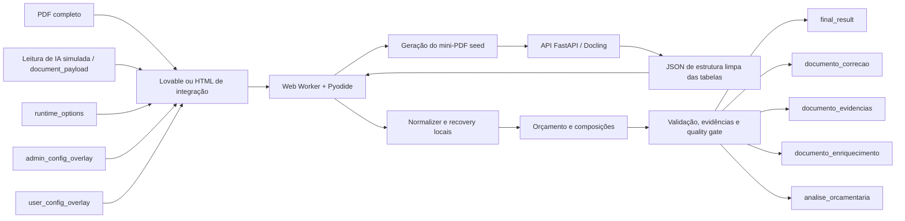

# ParserOrca

> Parser de documentos de obras públicas e orçamentos de infraestrutura, executado no navegador com Pyodide e integrado a uma API FastAPI/Docling para leitura estrutural de tabelas.


O **ParserOrca** transforma PDFs de orçamento de obras públicas em JSON estruturado e revisável. O projeto combina processamento local no navegador, contratos JSON explícitos, extração estrutural de tabelas com Docling, normalização em Python e documentos auxiliares de correção, evidência e auditoria.

O fluxo foi projetado para integração com o **Lovable**: a interface envia o PDF, os metadados observados no documento e as opções de execução; o parser devolve dados prontos para consumo pela aplicação e informações suficientes para revisão humana quando houver inconsistências.

---

## Visão rápida para avaliação

| Área | Aplicação no projeto |
|---|---|
| Python | Parsing, normalização, validação, reconstrução de tabelas e geração dos outputs |
| Pyodide | Execução do parser Python no navegador por Web Worker |
| FastAPI | API responsável pela extração estrutural das tabelas com Docling |
| Docling | Identificação de colunas, geometria, cabeçalhos e estrutura das páginas seed |
| JSON / JSON Schema | Contratos formais de entrada, runtime, overlays e saída |
| HTML / JavaScript | Ambiente de integração que simula o fluxo do Lovable |
| Pytest | Testes unitários, integração, contratos e regressões documentais |
| CORS e API key | Comunicação controlada entre navegador/Lovable e API Docling |
| Evidência e auditoria | Rastreabilidade de valores, divergências e decisões do parser |

### Principais entregas

- orçamento sintético estruturado;
- composições SINAPI-like, próprias e SICRO;
- documento de correção acionável para a interface;
- documento de evidências técnicas;
- sugestões de enriquecimento da configuração;
- métricas de cobertura, confiança, qualidade e consistência;
- ambiente HTML para teste do fluxo completo sem depender do Lovable.

---

## Arquitetura



### Onde cada parte é executada

| Componente | Responsabilidade | Local de execução |
|---|---|---|
| Lovable ou HTML demo | Seleção do PDF, edição do payload, configuração e visualização dos resultados | Navegador |
| Pyodide worker | Execução do parser, normalização, recovery, validação e montagem dos outputs | Navegador |
| Gerador de seed | Recorta as páginas representativas do orçamento e das composições | Navegador |
| API Docling | Analisa somente o mini-PDF seed e devolve a estrutura das tabelas | Servidor FastAPI |
| Base config | Regras fixas, aliases, unidades, perfis de banco e políticas do parser | Bundle local do parser |
| Overlays | Customizações persistidas pelo admin ou pelo usuário | Plataforma integradora |

> No fluxo browser, o PDF completo permanece no navegador. A API recebe somente o mini-PDF com as páginas seed necessárias para descobrir a estrutura das tabelas.

---

## Demonstração HTML que simula o Lovable

O repositório possui um ambiente de integração em:

```text
parser_browser/browser/demo/index.html
```

Esse HTML não é apenas uma página visual. Ele reproduz o fluxo operacional esperado no Lovable:

1. importa um PDF;
2. recebe ou permite editar o JSON que representa a leitura inicial feita pela IA do Lovable;
3. valida o contrato do payload;
4. gera um mini-PDF com as páginas seed;
5. envia o seed para a API Docling;
6. recebe a estrutura de colunas e geometria;
7. executa o parser completo no navegador com Pyodide;
8. mostra e permite baixar todos os outputs.

### O que significa “leitura de IA simulada”

O campo **Payload Lovable/API preservado** contém o JSON que, na aplicação real, seria produzido pela etapa de leitura do Lovable/IA. O HTML não chama um modelo de IA. Ele permite colar, editar ou usar um payload de exemplo para reproduzir exatamente a etapa posterior à leitura inicial.

O payload simulado informa, entre outros pontos:

- nome e quantidade de páginas do arquivo;
- intervalo de páginas do orçamento;
- intervalo de páginas das composições;
- páginas seed;
- cabeçalhos observados;
- nome canônico de cada coluna;
- amostras da primeira linha;
- perfis e pistas específicas do documento.

O fluxo principal do HTML **não usa** um endpoint artificial de simulação. A execução passa pelo Web Worker, pela API Docling e pelo parser Pyodide, como na integração real.

### Botões principais

| Botão | Função |
|---|---|
| `Aplicar campos no payload` | Atualiza o JSON com arquivo, páginas, ranges e seeds informados na tela |
| `Validar payload` | Confere campos obrigatórios e separação entre dados semânticos e runtime |
| `Testar Docling com seed` | Gera o mini-PDF e testa somente a etapa de estruturação Docling |
| `Executar fluxo completo browser` | Executa Docling, normalização, parsing, recovery e geração de outputs |
| `Resetar worker` | Reinicia o ambiente Pyodide/Web Worker |

### Abas de resultado

- Preview do orçamento;
- JSON final;
- Correção;
- Evidências;
- Enriquecimento;
- Docling/seed;
- Payload usado;
- Budget stage;
- Compositions stage;
- Acurácia;
- Contrato dos outputs;
- Contrato Lovable;
- Confiança por entidade;
- Revisões Lovable;
- Cobertura;
- Base config;
- Reparse seletivo;
- Consenso de perfis;
- Debug overlay.

### Executar o HTML localmente

#### 1. Subir a API Docling

```powershell
cd api_docling
python -m venv .venv
.\.venv\Scripts\Activate.ps1
python -m pip install --upgrade pip
pip install -r requirements-server.txt

$env:API_PDF_ENV="development"
$env:API_PDF_DOCS_ENABLED="true"
$env:API_PDF_CORS_ALLOW_ORIGINS="http://127.0.0.1:5500,http://localhost:5500"
$env:DOCLING_OCR_ENABLED="false"
$env:DOCLING_TIMEOUT_SECONDS="240"

uvicorn app.main:app --host 127.0.0.1 --port 8000
```

#### 2. Servir a demonstração por HTTP

Na raiz do repositório, em outro terminal:

```powershell
python -m http.server 5500 --directory parser_browser/browser/demo
```

Abra:

```text
http://127.0.0.1:5500
```

> O demo deve ser aberto por HTTP. A execução direta por `file://` impede o carregamento correto do Web Worker e dos arquivos do bundle Pyodide.

---

## Contratos de entrada

O input lógico é separado em blocos independentes. Essa separação impede que configurações de infraestrutura sejam misturadas com informações observadas no documento.

```text
PDF
+ document_payload
+ runtime_options
+ admin_config_overlay
+ user_config_overlay
```

### 1. PDF

Arquivo original selecionado no navegador. O parser local usa o documento completo. O worker gera o arquivo temporário `docling-seed-pages.pdf`, contendo somente as páginas representativas enviadas à API.

### 2. `document_payload`

Contém apenas informações do documento atual.

```json
{
  "version": "v61.0.75-correction-output-contract-and-review-index",
  "document": {
    "filename": "orcamento.pdf",
    "page_count": 148,
    "title": "Construção da casa do produtor"
  },
  "ranges": {
    "budget": {"start": 2, "end": 4},
    "compositions": {"start": 9, "end": 139}
  },
  "docling_seed_pages": {
    "budget": 2,
    "composition": 9
  },
  "tables": {
    "budget": {
      "observed_headers": [
        {
          "text": "CÓDIGO",
          "header_text": "CÓDIGO",
          "canonical": "codigo",
          "sample_text": "12345/001",
          "content_text": "12345/001",
          "first_row_text": "12345/001"
        }
      ]
    },
    "composition": {
      "observed_headers": [
        {
          "text": "Valor Unit",
          "canonical": "valor_unit",
          "first_row_text": "521,39"
        }
      ]
    }
  }
}
```

#### Campos principais do `document_payload`

| Caminho | Tipo | Descrição |
|---|---|---|
| `version` | string | Versão do contrato/parser associada ao payload |
| `document.filename` | string | Nome do PDF |
| `document.page_count` | integer | Quantidade de páginas |
| `document.title` | string | Título identificado no documento |
| `ranges.budget.start/end` | integer | Intervalo do orçamento sintético |
| `ranges.compositions.start/end` | integer | Intervalo das composições |
| `docling_seed_pages.budget` | integer | Página representativa do cabeçalho do orçamento |
| `docling_seed_pages.composition` | integer | Página representativa da estrutura de composição |
| `tables.budget` | object | Pistas estruturais da tabela de orçamento |
| `tables.composition` | object | Pistas estruturais das composições |
| `ai_hints` | object | Pistas opcionais sobre ruído, seções, famílias de página e seleção |
| `base_id` | string | Perfil base de interpretação do documento |
| `fixed_contract` | object | Contrato fixo opcional preservado pela integração |
| `parser_contract` | object | Políticas declaradas para a execução do parser |

#### Contrato de um cabeçalho observado

| Chave | Tipo | Finalidade |
|---|---|---|
| `text` | string | Texto visível do cabeçalho no PDF |
| `header_text` | string | Texto normalizado do cabeçalho |
| `canonical` | string | Nome interno do campo, por exemplo `codigo`, `descricao` ou `valor_unit` |
| `sample_text` | string | Amostra de conteúdo da coluna |
| `content_text` | string | Conteúdo observado usado para confirmar o mapeamento |
| `first_row_text` | string | Valor da primeira linha de dados |
| `group` | string | Grupo de cabeçalho, quando existe coluna agrupadora |
| `ignore_in_domain` | boolean | Mantém a coluna como limite estrutural sem expô-la no domínio final |

Não pertencem ao `document_payload`:

- endpoint da API;
- timeout;
- API key;
- política de cache;
- modo local/remoto;
- regras internas de recuperação;
- configurações globais da plataforma.

### 3. `runtime_options`

Controla somente a execução atual.

```json
{
  "docling_endpoint": "http://127.0.0.1:8000/docling/extract-table-structure",
  "docling_timeout_ms": 240000,
  "clear_cache_before_run": false,
  "bypass_docling_cache": false,
  "targeted_recovery_max_pages_per_batch": 12,
  "normalizer_mode": "local_pyodide"
}
```

| Chave | Tipo | Descrição |
|---|---|---|
| `docling_endpoint` | string | URL do endpoint Docling |
| `docling_timeout_ms` | integer | Limite de espera da requisição |
| `clear_cache_before_run` | boolean | Limpa o cache antes da execução |
| `bypass_docling_cache` | boolean | Ignora o cache para a requisição atual |
| `targeted_recovery_max_pages_per_batch` | integer | Máximo de páginas por lote de recuperação |
| `normalizer_mode` | string | Modo do normalizador; no browser, `local_pyodide` |

### 4. `admin_config_overlay`

Configuração persistente controlada pela plataforma ou pelo administrador.

```json
{
  "knowledge_base": {
    "units": {
      "global_additions": ["M3XKM", "T.KM"]
    }
  },
  "bank_aliases": {
    "SICRO3": "SICRO",
    "Próprio": "PROPRIO"
  }
}
```

### 5. `user_config_overlay`

Configuração persistente específica de usuário, empresa ou projeto.

```json
{
  "custom_bank_profiles": {
    "banco_municipal_exemplo": {
      "family": "sinapi_like",
      "columns": [
        {"header": "CÓD.", "canonical": "codigo"},
        {"header": "SERVIÇO", "canonical": "descricao"},
        {"header": "UN", "canonical": "und"},
        {"header": "QTD", "canonical": "quant"},
        {"header": "VALOR", "canonical": "valor_unit"},
        {"header": "TOTAL", "canonical": "total"}
      ]
    }
  }
}
```

A ordem de composição da configuração é:

```text
base_config padrão
→ admin_config_overlay
→ user_config_overlay
→ configuração efetiva em memória
```

Os overlays não alteram automaticamente os arquivos do bundle.

---

## Contrato da API Docling

### Endpoint principal

```http
POST /docling/extract-table-structure
Content-Type: multipart/form-data
```

### Campos enviados

| Campo | Tipo | Conteúdo |
|---|---|---|
| `file` | arquivo PDF | No fluxo browser, contém o mini-PDF seed |
| `payload` | string JSON | `document_payload` validado e serializado |

### Header opcional

```http
x-api-key: SUA_CHAVE
```

O nome do header é configurável por `API_PDF_API_KEY_HEADER`.

### Exemplo com `curl`

```bash
curl -X POST "http://127.0.0.1:8000/docling/extract-table-structure" \
  -H "x-api-key: SUA_CHAVE" \
  -F "file=@docling-seed-pages.pdf;type=application/pdf" \
  -F 'payload={"document":{"filename":"orcamento.pdf"},"ranges":{"budget":{"start":2,"end":4},"compositions":{"start":9,"end":139}},"docling_seed_pages":{"budget":2,"composition":9},"tables":{"budget":{"observed_headers":[]},"composition":{"observed_headers":[]}}}'
```

### Estrutura resumida da resposta Docling

```json
{
  "version": "...",
  "tables": {
    "budget": {
      "kind": "budget",
      "source": "docling",
      "template_id": "budget:seed",
      "partial_structure": false,
      "available_columns": ["item_agregador", "codigo", "fonte"],
      "missing_expected_columns": [],
      "missing_domain_columns": [],
      "usable_for": ["item_agregador", "codigo", "fonte"],
      "columns": [
        {
          "canonical": "codigo",
          "header": "CÓDIGO",
          "header_text": "CÓDIGO",
          "sample_text": "12345/001",
          "content_text": "12345/001",
          "physical_index": 1,
          "x0": 70.2,
          "x1": 123.7,
          "width": 53.5,
          "geometry_source": "docling",
          "geometry_confidence": 0.98
        }
      ],
      "ignored_columns": [],
      "grouped_headers": [],
      "warnings": []
    },
    "composition": {}
  },
  "runtime": {},
  "docling_trace": {},
  "metadata": {
    "api_mode": "seed_pages_light",
    "structure_only": true,
    "docling_scope": "seed_pages_only",
    "parser_expected_to_process_full_ranges": true,
    "cache": {},
    "performance_trace": {},
    "payload_usage": {},
    "quality": {},
    "calibrated_document_profile": {}
  },
  "calibrated_document_profile": {}
}
```

#### Campos de uma tabela devolvida pela API

| Chave | Descrição |
|---|---|
| `kind` | Família funcional da tabela |
| `source` | Origem da estrutura |
| `template_id` | Identificador da tabela encontrada |
| `partial_structure` | Indica se a API encontrou somente parte das colunas esperadas |
| `available_columns` | Colunas detectadas |
| `missing_expected_columns` | Colunas esperadas que não foram encontradas |
| `missing_domain_columns` | Campos de domínio ausentes |
| `usable_for` | Colunas que podem ser usadas pelo parser |
| `columns` | Colunas normais com geometria e mapeamento canônico |
| `ignored_columns` | Colunas estruturais usadas como limite, mas não exportadas |
| `grouped_headers` | Cabeçalhos agrupadores |
| `warnings` | Avisos de estrutura parcial ou recuperação de mapeamento |

### Outros endpoints

| Método | Endpoint | Finalidade |
|---|---|---|
| `GET` | `/` | Informações básicas do serviço |
| `GET` | `/health` | Verificação simples de disponibilidade |
| `GET` | `/healthz` | Health check alternativo |
| `GET` | `/version` | Versões dos contratos, bundle e runtime |
| `GET` | `/docling/runtime` | Estado do runtime Docling |
| `POST` | `/docling/validate-payload` | Valida o contrato antes da extração |
| `POST` | `/docling/extract-table-structure` | Extrai a estrutura das tabelas |
| `GET` | `/admin/cache/stats` | Informa entradas do cache |
| `POST` | `/admin/cache/clear` | Limpa o cache da API |

---

## Contratos de saída

O parser organiza a saída pública em um resultado principal e documentos especializados.

```json
{
  "status": "ok",
  "version": "...",
  "orcamento_sintetico": {},
  "composicoes": {},
  "documento_correcao": {},
  "documento_evidencias": {},
  "documento_enriquecimento": {},
  "analise_orcamentaria": {}
}
```

### `orcamento_sintetico`

Representa a hierarquia do orçamento. Metas e submetas recebem `custo_total`; itens folha recebem `custo_parcial`. Os valores públicos preservam o conteúdo declarado no PDF.

### `composicoes`

Agrupa composições por família e papel:

```json
{
  "sinapi_like": {
    "principais": {},
    "auxiliares_globais": {}
  },
  "sicro": {
    "principais": {},
    "auxiliares_globais": {}
  }
}
```

### `documento_correcao`

Índice de revisão consumido pela interface.

```json
{
  "schema_version": "correction_document.v2.actionable_review",
  "resumo_final_curto": {},
  "problemas": [],
  "problemas_por_categoria": {}
}
```

Cada problema pode conter:

```json
{
  "id": "...",
  "categoria": "extraction",
  "tipo": "campo_critico_ausente",
  "gravidade": "warning",
  "status": "needs_user_review",
  "local": {
    "source_section": "composicoes_analiticas",
    "path": "composicoes.sinapi_like.principais...",
    "item": "4.5.2",
    "codigo": "93391",
    "banco": "SINAPI",
    "composicao": "93391|SINAPI",
    "row_group": "insumos",
    "row_index": 4,
    "page": 24,
    "page_interval": {
      "page_start": 24,
      "page_end": 24,
      "page": 24
    }
  },
  "campo": "total",
  "valor_atual": null,
  "valor_pdf": "123,45",
  "valor_calculado": "123,45",
  "acao_recomendada": "Confirmar o valor na página indicada",
  "material_apoio": {
    "crop_hint": {
      "ui_action": "open_pdf_page_and_focus_region",
      "page": 24,
      "page_start": 24,
      "page_end": 24,
      "focus": "93391|SINAPI",
      "line_preview": "..."
    },
    "line_preview": "...",
    "evidence_ref": "documento_evidencias.evidence_registry"
  }
}
```

Categorias principais:

- `quality_gate`;
- `extraction`;
- `document_consistency`;
- `possible_left_behind_lines` ou `left_behind_scan`.

### `documento_evidencias`

Registra evidências físicas e lógicas utilizadas pelo parser:

- página e seção do documento;
- ocorrências de código e banco;
- contexto da linha;
- geometria;
- índices de evidência;
- referências de reparos;
- justificativas de aceitação ou rejeição.

Esse documento explica decisões técnicas. Ele não altera a configuração do parser.

### `documento_enriquecimento`

Contém sugestões de evolução da configuração, como:

- novos aliases de bancos;
- unidades não cadastradas;
- padrões de código;
- perfis de tabelas personalizados;
- sugestões provenientes do documento atual.

As sugestões nunca são aplicadas automaticamente:

```json
{
  "approval_policy": {
    "auto_apply_to_base_config": false
  }
}
```

### `analise_orcamentaria`

Painel técnico e operacional. Pode conter:

- `accuracy_report`;
- `extraction_coverage_report`;
- `entity_confidence_report`;
- `base_config_layering`;
- `outputs_package_manifest`;
- `lovable_operational_summary`;
- `lovable_contract_reference`;
- `debug_recovery`;
- métricas de performance e quality gate.

---

## Regras de integridade do contrato

1. **O valor público vem do PDF.** Cálculos verificam consistência, mas não substituem automaticamente valores declarados.
2. **Configuração de runtime não entra no payload semântico.** Endpoint, timeout, cache e chaves ficam separados.
3. **O PDF completo permanece no navegador no fluxo Pyodide.** A API recebe apenas as páginas seed.
4. **Estrutura parcial do Docling não bloqueia todo o parser.** As colunas encontradas são usadas e os campos ausentes seguem para fallback/recovery local.
5. **Evidência não é enriquecimento.** Evidências justificam decisões; enriquecimento sugere futuras melhorias da configuração.
6. **Debug não é saída pública de revisão.** Rastros pesados ficam em `analise_orcamentaria.debug_recovery`.
7. **Overlays não sobrescrevem o bundle.** A configuração efetiva é montada em memória.
8. **Correções automáticas exigem evidência suficiente.** Itens incertos permanecem marcados para revisão humana.

---

## Estrutura do repositório

```text
PaserEngDocs/
├── api_docling/                 # API FastAPI e integração Docling
│   ├── app/
│   ├── db/
│   ├── tests/
│   └── requirements-server.txt
├── parser_browser/              # Parser executado no browser/Pyodide
│   ├── app/
│   │   ├── browser/
│   │   ├── core/
│   │   ├── intake/
│   │   ├── normalizer/
│   │   ├── parser/
│   │   └── integrations/
│   ├── browser/
│   │   ├── demo/                # HTML que simula o Lovable
│   │   └── pyodide/             # Worker e bundle
│   └── db/                      # Base config e fragmentos de configuração
├── schemas/
│   ├── input/                   # JSON Schemas de entrada
│   └── output/                  # JSON Schemas de saída
├── examples/                    # Payloads, overlays e outputs mínimos
├── docs/
│   └── lovable_contracts/       # Contratos detalhados da integração
├── tests/                       # Testes do parser e regressões
└── tools/                       # Validadores e verificações de integridade
```

---

## Schemas e exemplos

### Schemas formais

```text
schemas/input/document_payload.schema.json
schemas/input/runtime_options.schema.json
schemas/input/base_config_overlay.schema.json
schemas/output/final_result.schema.json
schemas/output/correction_document.schema.json
```

### Exemplos prontos

```text
examples/lovable/minimal_payload.json
examples/lovable/runtime_options.local.json
examples/lovable/admin_config_overlay.example.json
examples/lovable/user_config_overlay.example.json
examples/lovable/final_result_minimal.example.json
```

### Documentação detalhada dos contratos

```text
docs/lovable_contracts/00_README_INTEGRACAO_LOVABLE.md
docs/lovable_contracts/01_INPUT_CONTRACT.md
docs/lovable_contracts/02_OUTPUTS_CONTRACT.md
docs/lovable_contracts/03_BASE_CONFIG_CONTRACT.md
docs/lovable_contracts/04_RUNTIME_OPTIONS_CONTRACT.md
docs/lovable_contracts/05_PIPELINE_STAGES.md
docs/lovable_contracts/06_ERROR_AND_CORRECTION_CONTRACT.md
docs/lovable_contracts/07_EVIDENCE_AND_ENRICHMENT_CONTRACT.md
docs/lovable_contracts/08_COMPOSITIONS_AND_SICRO_ASSOCIATION.md
docs/lovable_contracts/09_SCHEMA_COVERAGE_AND_MISSING_COLUMNS.md
docs/lovable_contracts/10_HTML_DEMO_TESTING_GUIDE.md
docs/lovable_contracts/11_EXAMPLES_FULL_FLOW.md
docs/lovable_contracts/12_SICRO_JSON_STRUCTURE_AND_CALCULATION.md
docs/lovable_contracts/13_CORRECTION_DOCUMENT_UI_REVIEW_CONTRACT.md
```

---

## Testes

O projeto possui três níveis complementares de validação.

### 1. Testes automatizados com Pytest

```powershell
python -m venv .venv
.\.venv\Scripts\Activate.ps1
python -m pip install --upgrade pip
pip install -r requirements-dev.txt
pytest
```

A suíte cobre, entre outros pontos:

- contratos de payload e output;
- normalização de colunas;
- fidelidade numérica;
- orçamento e composições;
- SICRO;
- recuperação seletiva;
- evidências e cobertura;
- documento de correção;
- regressões com documentos reais;
- integridade de release.

### 2. Validação de contratos por CLI

```powershell
$env:PYTHONPATH="parser_browser"
python tools/validate_lovable_contract.py `
  --payload examples/lovable/minimal_payload.json `
  --final examples/lovable/final_result_minimal.example.json
```

### 3. Teste de integração no HTML

O HTML demo valida o fluxo mais próximo do uso real:

```text
PDF + payload simulado do Lovable
→ worker Pyodide
→ API Docling
→ normalização local
→ outputs exibidos e baixados
```

Esse teste permite verificar CORS, API key, upload multipart, worker, bundle Pyodide, contratos, estrutura Docling e apresentação dos resultados em uma única execução.

---

## Configuração da API

Variáveis principais:

```env
API_PDF_ENV=development
API_PDF_DOCS_ENABLED=true
API_PDF_CORS_ALLOW_ORIGINS=http://127.0.0.1:5500,http://localhost:5500
API_PDF_CORS_ALLOW_METHODS=GET,POST,OPTIONS
API_PDF_CORS_ALLOW_HEADERS=*
API_PDF_API_KEY=
API_PDF_API_KEY_HEADER=x-api-key
API_PDF_MAX_UPLOAD_MB=25
DOCLING_OCR_ENABLED=false
DOCLING_TIMEOUT_SECONDS=240
API_PDF_DOCLING_CACHE_MAX_ENTRIES=32
```

Para produção, os domínios permitidos em CORS devem ser definidos explicitamente. Chaves e segredos não devem ser incluídos no `document_payload`, no HTML ou no histórico do Git.

---

## Princípios de uso

- O resultado deve ser revisado quando houver avisos bloqueantes ou baixa confiança.
- O parser preserva a fidelidade do documento, inclusive quando o PDF contém uma divergência matemática.
- O `documento_correcao` orienta a revisão na interface.
- O `documento_evidencias` fornece rastreabilidade.
- O `documento_enriquecimento` propõe evolução futura sem modificar a base automaticamente.

---

## Contexto do projeto

Projeto aplicado à análise de documentos de obras públicas e orçamentos de infraestrutura, com uso de Python, parsing de PDFs, integração de API, validação de dados e execução em navegador. O repositório demonstra a comunicação entre frontend, Web Worker, Pyodide, backend FastAPI e contratos JSON formais.

## Licença

Consulte o arquivo [`LICENSE`](LICENSE).
