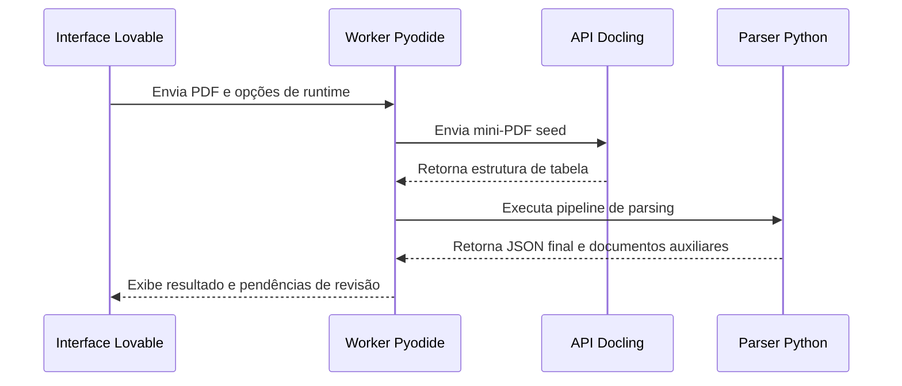

# Integração Lovable e Pyodide

## Objetivo

Executar o parser Python no navegador e manter a experiência integrada à aplicação Lovable.

## Fluxo

## Entradas do worker

- PDF ou conteúdo extraído do PDF.
- Configurações do usuário.
- Opções de runtime.
- Estrutura de tabelas retornada pela API Docling.

## Saídas para a interface

- `final_result`
- `documento_correcao`
- `documento_evidencias`
- `analise_orcamentaria`

## Revisão visual

O documento de correção mantém informações de página, item e evidência. Isso permite que a interface abra a página ou recorte correspondente enquanto o usuário revisa uma divergência.
